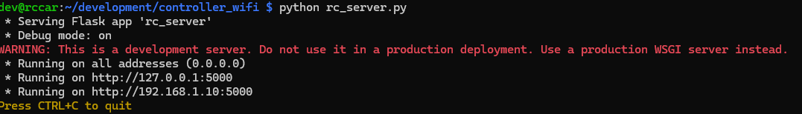
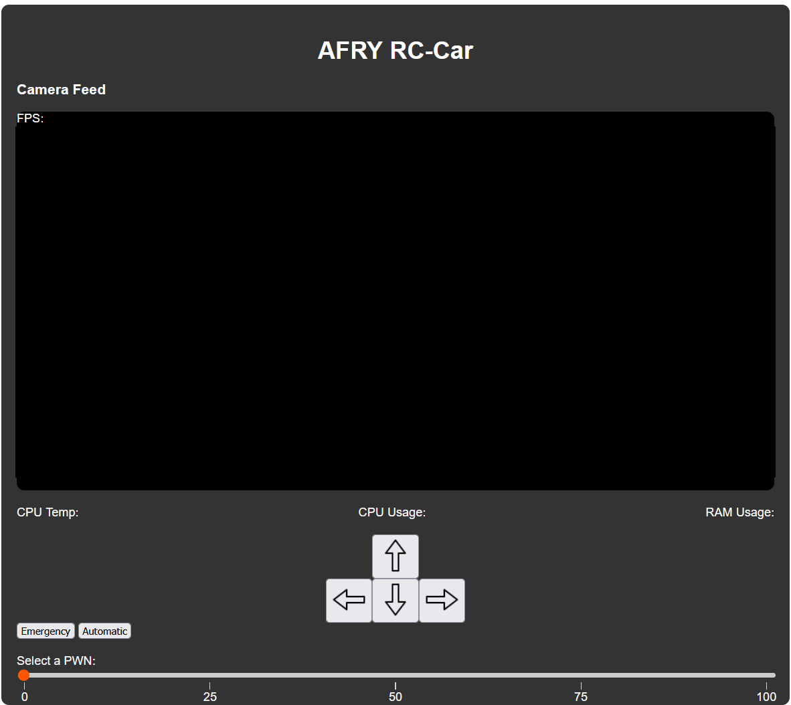
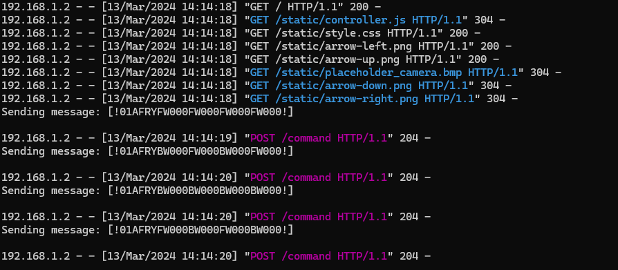

# Flask server for the Robot

Important to use virtual environment in case we need to install other version of the python packages.

Not the finally design, but we will need someone who is a bit more comfortable with frontend to make it look nicer.

## Installing

### Create environment

To install all the dependencies that are needed use following command

> pip install -r requirements.txt

please do update by adding or removing plugins if needed.

### Activate environment

> source .venv/bin/activate

# RC_controller

### Run the webb app

To run the app, cd in to the project folder and

> python rc_server.py

inside rc_server.py we have following code

> server_ip_address = "0.0.0.0"
> Using this address we will get a IP addresse autoamtically assigned to our server. If we want to use a specific IP, then we can just change it in the code.

Just press on the address or type it in on the webbrowser.

## Web Gui

#### Interaction

The slide which you can see on the GUI regulates the PWN value that is to be sent. Check logic in the code, it might need a lot of tweaking in the end.

Thoughts of tweaks are mostly about the turning of the robot.
